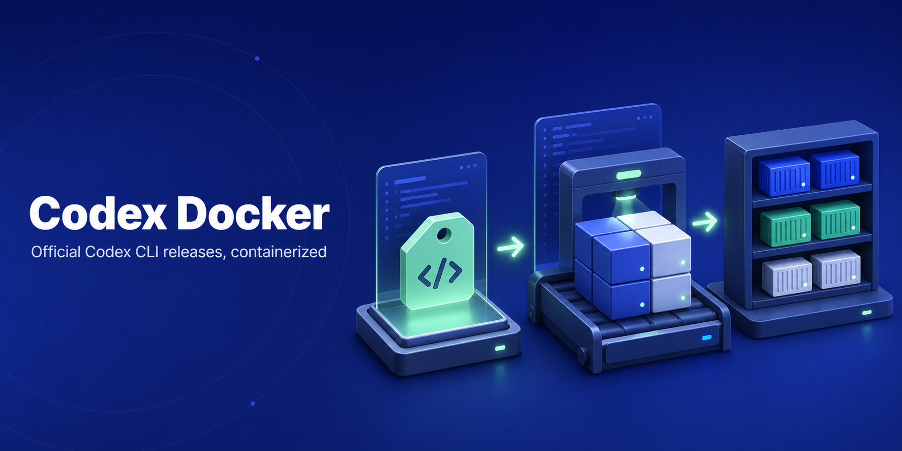

# Codex Docker

<!-- markdownlint-disable-next-line MD036 -->
**OpenAI Codex CLI Docker images for repeatable agent automation.**

[](https://github.com/icoretech/codex-docker/actions/workflows/build.yml)
[](https://github.com/icoretech/codex-docker/actions/workflows/publish.yml)
[](https://github.com/openai/codex/releases)
[](https://github.com/icoretech/codex-docker/pkgs/container/codex-docker)
[](https://github.com/icoretech/codex-docker)



Run the official [OpenAI Codex CLI](https://github.com/openai/codex)
without installing it on the host. This repository builds minimal multi-arch
Docker images from upstream Linux musl release assets, verifies the downloaded
archive digest, and publishes matching tags to GHCR for `linux/amd64` and
`linux/arm64`.

If this saves you from rebuilding Codex containers by hand,
[star the repo](https://github.com/icoretech/codex-docker) so other
agent-infra users can find it.

## Quick Start

Prerequisites: Docker, and an OpenAI/Codex auth method when running commands
that call the model.

Set the image version once:

```bash
# renovate: datasource=github-releases depName=openai/codex extractVersion=^rust-v(?<version>.+)$
CODEX_VERSION=0.148.0
```

Pull and run Codex:

```bash
docker pull ghcr.io/icoretech/codex-docker:${CODEX_VERSION}
docker run --rm -it ghcr.io/icoretech/codex-docker:${CODEX_VERSION} --help
```

Persist Codex config, auth, and logs across runs:

```bash
mkdir -p ./.codex

docker run --rm -it \
  -e CODEX_HOME=/home/codex/.codex \
  -v "$PWD/.codex:/home/codex/.codex" \
  -v "$PWD:/workspace" \
  ghcr.io/icoretech/codex-docker:${CODEX_VERSION}
```

Use `latest` only for quick trials. Pin `${CODEX_VERSION}` for CI, runners, and
reproducible agent workflows.

## Why This Image

- **No host install**: run Codex from Docker on workstations, CI jobs, and
  remote runners.
- **Version-matched tags**: image tags mirror upstream Codex CLI releases, with
  `latest` as a convenience tag.
- **Multi-arch by default**: the publish workflow pushes `linux/amd64` and
  `linux/arm64` images to GHCR.
- **Sandbox-ready base**: the runtime image includes `bubblewrap`, `git`,
  `openssh-client`, and `ripgrep`.
- **Non-root runtime**: commands run as the `codex` user inside `/workspace`.
- **Agent-facing entry points**: use the same image for `codex`, `codex exec`,
  `mcp-server`, `remote-control start`, and websocket `app-server`.
- **Code Mode host**: both published Linux architectures bundle the matching
  upstream `codex-code-mode-host` executable. Code Mode is selected by the
  upstream Codex client and model configuration, not by a Docker-specific
  command.
- **Container auth helpers**: `codex-bootstrap` supports file-backed API-key,
  access-token, and device-auth login flows.

## Code Mode

The image bundles the `codex-code-mode-host` executable matching the pinned
`${CODEX_VERSION}` release for both `linux/amd64` and `linux/arm64`. Use the
same pinned image invocation as a normal Codex session:

```bash
docker run --rm -it \
  -e CODEX_HOME=/home/codex/.codex \
  -v "$PWD/.codex:/home/codex/.codex" \
  -v "$PWD:/workspace" \
  ghcr.io/icoretech/codex-docker:${CODEX_VERSION}
```

The upstream Codex client and model configuration select Code Mode; the image
does not require a Docker-specific Code Mode command. The container-local host
executes the Code Mode runtime. If the Codex client is configured to use a
Pooler, its model Responses traffic may travel through Pooler while the local
host still executes Code Mode; Pooler does not provide or spawn this binary.
Code Mode availability remains subject to the selected model and account
features.

## Common Commands

Run an interactive CLI session:

```bash
docker run --rm -it \
  -e CODEX_HOME=/home/codex/.codex \
  -v "$PWD/.codex:/home/codex/.codex" \
  -v "$PWD:/workspace" \
  ghcr.io/icoretech/codex-docker:${CODEX_VERSION}
```

Run a one-shot `codex exec` command against the current directory:

```bash
docker run --rm -it \
  -e CODEX_HOME=/home/codex/.codex \
  -v "$PWD/.codex:/home/codex/.codex" \
  -v "$PWD:/workspace" \
  ghcr.io/icoretech/codex-docker:${CODEX_VERSION} \
  exec --skip-git-repo-check --ephemeral -C /workspace "summarize this workspace"
```

Start the stdio MCP server:

```bash
docker run --rm -i \
  -e CODEX_HOME=/home/codex/.codex \
  -v "$PWD/.codex:/home/codex/.codex" \
  ghcr.io/icoretech/codex-docker:${CODEX_VERSION} mcp-server
```

Check the available container helper commands:

```bash
docker run --rm -it \
  ghcr.io/icoretech/codex-docker:${CODEX_VERSION} codex-bootstrap help
```

Available tags are listed on the
[GitHub Packages page](https://github.com/icoretech/codex-docker/pkgs/container/codex-docker).

## Login Helpers

The image defaults to Codex's native CLI. Use `codex-bootstrap` when a container
login flow should force Codex auth state into mounted `CODEX_HOME` files.

API key login:

```bash
docker run --rm -it \
  -e OPENAI_API_KEY="$OPENAI_API_KEY" \
  -e CODEX_HOME=/home/codex/.codex \
  -v "$PWD/.codex:/home/codex/.codex" \
  ghcr.io/icoretech/codex-docker:${CODEX_VERSION} codex-bootstrap api-key-login
```

Codex access token login:

```bash
docker run --rm -it \
  -e CODEX_ACCESS_TOKEN="$CODEX_ACCESS_TOKEN" \
  -e CODEX_HOME=/home/codex/.codex \
  -v "$PWD/.codex:/home/codex/.codex" \
  ghcr.io/icoretech/codex-docker:${CODEX_VERSION} codex-bootstrap access-token-login
```

Device auth and status:

```bash
docker run --rm -it \
  -e CODEX_HOME=/home/codex/.codex \
  -v "$PWD/.codex:/home/codex/.codex" \
  ghcr.io/icoretech/codex-docker:${CODEX_VERSION} codex-bootstrap device-auth

docker run --rm -it \
  -e CODEX_HOME=/home/codex/.codex \
  -v "$PWD/.codex:/home/codex/.codex" \
  ghcr.io/icoretech/codex-docker:${CODEX_VERSION} codex-bootstrap status
```

For trusted enterprise automation, Codex access tokens can also be provided
ephemerally without writing auth state:

```bash
docker run --rm -it \
  -e CODEX_ACCESS_TOKEN="$CODEX_ACCESS_TOKEN" \
  -v "$PWD:/workspace" \
  ghcr.io/icoretech/codex-docker:${CODEX_VERSION} \
  exec --skip-git-repo-check --ephemeral -C /workspace "summarize this workspace"
```

Use Platform API keys for general API-backed automation. Use Codex access tokens
only when a trusted private runner needs ChatGPT workspace identity,
ChatGPT-managed Codex entitlements, or enterprise workspace controls.

## Compose Demo

`examples/compose.yml` demonstrates the supported invocation modes with one
shared `codex_home` volume.

- `cli`: interactive `codex` for manual local sessions.
- `exec`: one-shot automation with `codex exec`, `--skip-git-repo-check`,
  `--ephemeral`, and `-C /workspace`.
- `mcp`: stdio `codex mcp-server` for MCP clients.
- `remote-control`: headless `codex remote-control start`.
- `app-server-ws`: authenticated websocket `codex app-server` for local
  websocket client testing.
- `native-login-*`: built-in `codex login` flows.
- `helper-*`: file-backed `codex-bootstrap` auth flows.

Run the demo image from GHCR:

```bash
docker compose -f examples/compose.yml --profile cli run --rm cli
docker compose -f examples/compose.yml --profile exec run --rm exec
docker compose -f examples/compose.yml \
  --profile mcp run --rm -T mcp mcp-server --help
```

Exercise a locally built image with the same Compose file:

```bash
docker build -t codex-docker:local .
CODEX_IMAGE=codex-docker:local \
  docker compose -f examples/compose.yml --profile exec run --rm exec
```

`examples/workspace/` is bind-mounted as `/workspace`; put a real repository
there before replacing the demo `exec --help` command with an actual prompt.

## Remote Control and Websocket App Server

`codex remote-control start` starts Codex's headless app-server path for remote
Codex clients. The foreground command uses a private local Unix socket
internally; it does not publish the `4500` websocket port shown by the separate
app-server example.

```bash
mkdir -p ./.codex

docker run --rm -it \
  -e CODEX_HOME=/home/codex/.codex \
  -v "$PWD/.codex:/home/codex/.codex" \
  -v "$PWD:/workspace" \
  ghcr.io/icoretech/codex-docker:${CODEX_VERSION} remote-control start
```

For a local websocket app-server that another Codex CLI can attach to, bind
deliberately and require websocket auth:

```bash
CODEX_REMOTE_AUTH_TOKEN=codex-local-dev-token

docker run --rm -it \
  -e CODEX_HOME=/home/codex/.codex \
  -v "$PWD/.codex:/home/codex/.codex" \
  -v "$PWD:/workspace" \
  -p 127.0.0.1:4500:4500 \
  ghcr.io/icoretech/codex-docker:${CODEX_VERSION} \
  app-server --listen ws://0.0.0.0:4500 \
  --ws-auth capability-token \
  --ws-token-sha256 a06a3642fee0991ee64f032f46306795f2bdcdb5396d5c887b37b0b120220328

CODEX_REMOTE_AUTH_TOKEN="$CODEX_REMOTE_AUTH_TOKEN" \
  codex --remote ws://127.0.0.1:4500 \
  --remote-auth-token-env CODEX_REMOTE_AUTH_TOKEN
```

Do not expose unauthenticated websocket listeners on public interfaces. For
shared or non-loopback listeners, prefer SSH port forwarding, TLS behind a
trusted proxy, or Codex websocket auth with secret-backed `--ws-token-file`,
`--ws-token-sha256`, or signed bearer tokens.

## AI Agent and MCP Integration

Use the image anywhere an agent or MCP client can invoke a local command.

Example MCP server configuration:

```json
{
  "mcpServers": {
    "codex": {
      "command": "docker",
      "args": [
        "run",
        "--rm",
        "-i",
        "-e",
        "CODEX_HOME=/home/codex/.codex",
        "-v",
        "codex_home:/home/codex/.codex",
        "ghcr.io/icoretech/codex-docker:latest",
        "mcp-server"
      ]
    }
  }
}
```

For pinned agent runners, replace `latest` with the version from
[Quick Start](#quick-start). For workflows that need repository context, add a
bind mount for the target workspace and pass `-C /workspace` to `codex exec`.

## Local Verification

Build and smoke-test the image:

```bash
docker build -t codex-docker:local .
IMAGE=codex-docker:local ./scripts/smoke-test.sh
```

Run the GitHub Actions build workflow locally with `act`:

```bash
act pull_request --container-architecture linux/amd64 -W .github/workflows/build.yml
```

The smoke test checks:

- `codex --version` matches `ARG CODEX_RELEASE_TAG`
- core help output renders
- login help includes API key, access token, and device auth flows
- `exec`, `mcp-server`, `remote-control start`, and `app-server` help paths
  respond
- `bubblewrap` is available for Codex Linux sandboxing
- `codex-code-mode-host` is installed, executable, resolves on `PATH`, and
  responds to `--help`
- `codex-bootstrap help` exposes the container helper commands

## Contributing

Open pull requests against `main`.
Keep version bumps aligned with Renovate's Dockerfile and README markers, and
run the local verification commands before merging behavior changes.

## Support

- **Image packaging issues**: open an issue in
  [icoretech/codex-docker](https://github.com/icoretech/codex-docker/issues).
- **Codex CLI behavior**: check the upstream
  [openai/codex](https://github.com/openai/codex) repository.
- **Published images**: inspect tags on the
  [GHCR package page](https://github.com/icoretech/codex-docker/pkgs/container/codex-docker).

## License

This repository packages upstream OpenAI Codex CLI release assets into Docker
images. No repository license metadata is currently published here; review the
upstream [OpenAI Codex repository](https://github.com/openai/codex) and its
license or terms before redistributing, mirroring, or deploying the packaged
software.

## Star History

[![Star History Chart][star-history-badge]][star-history-link]

[star-history-badge]: https://api.star-history.com/svg?repos=icoretech/codex-docker&type=Date
[star-history-link]: https://star-history.com/#icoretech/codex-docker&Date
